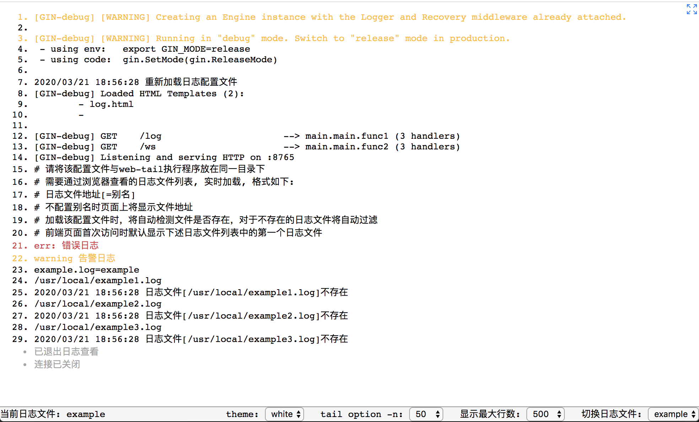

web-tail 服务端调用系统的 `tail` 命令，使用 [websocket](https://github.com/gorilla/websocket) 将需要滚动查看的日志文件显示在浏览器上，方便查看日志文件。

# 功能

> 由于web-tail底层实际上是调用系统提供的tail命令，因此该工具不适用于Windows系统

web-tail 当前包含功能如下：

- [x] 在浏览器中实时查看日志内容
- [x] 在浏览器中切换日志
- [x] 在服务端通过修改 `log.li` 配置文件即可实时添加或删除日志文件，无需重启web-tail
- [x] 支持tail -n参数
- [x] 错误与警告日志着色
- [x] 切换明暗两种主题
- [x] 全屏显示

# 依赖

web-tail主要使用websocket技术实现日志在浏览器页面的实时滚动，web框架采用gin(以便于添加认证等扩展功能)

依赖项目如下：

- [go1.13.4](https://golang.org/dl/)

- [gorilla/websocket](https://github.com/gorilla/websocket)
- [gin-gonic/gin](https://github.com/gin-gonic/gin)

# 配置

web-tail只需要一个`log.li`配置文件，配置比较简单，且支持热加载，示例配置文件内容如下：

~~~bash
日志目录
~~~

# 使用

> 可以下载源码自行编译也可下载已构建好的软件包直接使用，当前提供的编译后的包为mac与linux-amd64平台

## 从二进制包启动

根据需要，下载构建好的相应系统的[二进制压缩包](https://github.com/plholx/web-tail/releases)，解压后修改`log.li`配置文件，启动`web-tail`即可

```bash
# 下载web-tail-linux-amd64.zip或web-tail-Darwin-17.7.0.zip
# 解压
unzip web-tail-linux-amd64.zip
# 进入目录
cd web-tail-linux-amd64
# 根据需要修改log.li配置文件
# 启动 根据需要修改端口号
# 后台运行(linux)
setsid ./web-tail -addr=:8765 &> web-tail.log
# 前台运行
./web-tail -addr=:8765
```git add README.md

## 从源码启动

下载web-tail代码，进入web-tail目录，构建应用，默认你的系统已安装`golang` 需要的环境

~~~bash
# 构建mac系统的软件包
make build-mac
# 构建linux-amd64系统的软件包
make build-linux
# 同时构建上述两种系统的软件包
make build-all
# 其他系统架构(Windows除外)可自行修改Makefile文件进行构建
~~~

在`bin`目录下查看编译后生成的压缩包

将压缩包在本机或上传到相应的服务器上解压后，后续操作同`从二进制包启动

## 访问

打浏览器进行访问，地址：http://ip:8765/log, 按 `ESC` 键可退出与服务器的连接或在页面右下角切换不同的日志进行查看:

